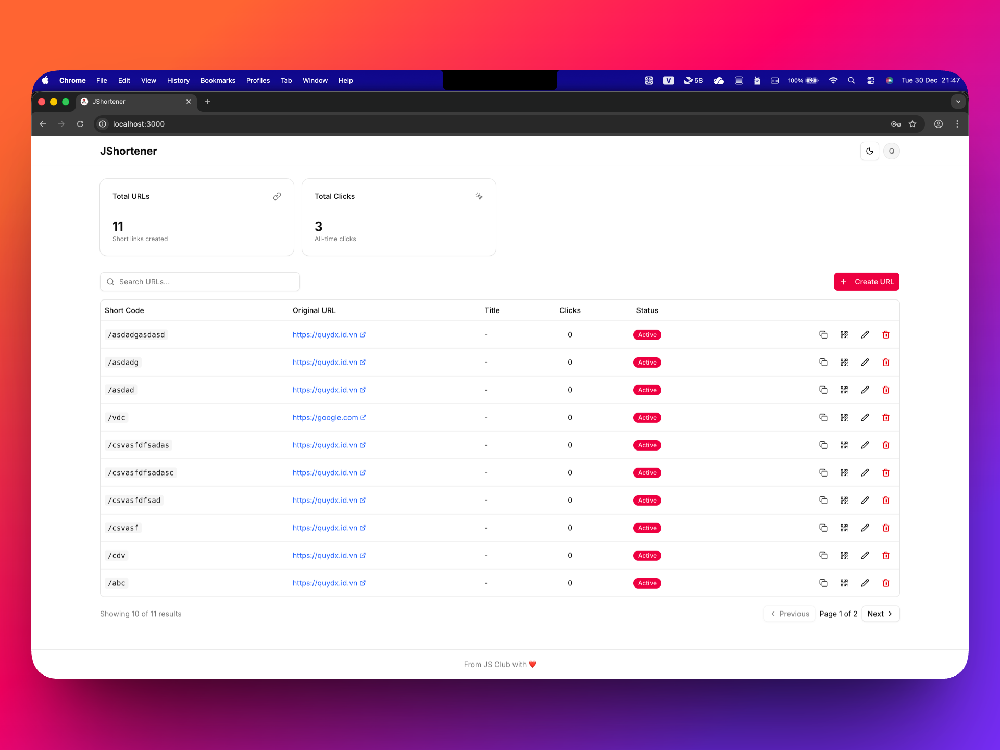

# JShortener

Dự án rút gọn liên kết (URL Shortener) được xây dựng với [Next.js](https://nextjs.org) và triển khai trên [Cloudflare Workers](https://workers.cloudflare.com/).

[](https://deploy.workers.cloudflare.com/?url=https://github.com/fu-js/jshortener-app)



## 📋 Danh sách kiểm tra triển khai nhanh (Quick Deploy Checklist)

Sau khi nhấn nút "Deploy to Cloudflare Workers", bạn sẽ được chuyển đến trang quản trị Cloudflare. Tại đây, bạn cần cấu hình các biến môi trường sau để ứng dụng hoạt động chính xác.

### 🔑 Các biến cần cấu hình (Required Variables)

- `BETTER_AUTH_SECRET` - Một chuỗi ký tự ngẫu nhiên dùng để bảo mật session.
- `BETTER_AUTH_URL` - URL gốc của ứng dụng (ví dụ: `https://jshortener.uk` hoặc `http://localhost:3000` khi chạy nội bộ).

### ⚙️ Cấu hình Workers Builds

Trong trang cấu hình triển khai, thiết lập các lệnh sau:

| Cài đặt | Giá trị |
|---------|---------|
| **Build command** | `npm run build:prod` |
| **Deploy command** | `npm run deploy:prod` |

> **Lưu ý**: Lệnh `build:prod` sẽ tự động chạy migrations D1 trước khi build ứng dụng.

### 🛠️ Cấu hình phát triển cục bộ (Local Development)

Để chạy dự án trên máy cá nhân, hãy tạo file `.dev.vars` tại thư mục gốc và thêm nội dung sau:

```bash
BETTER_AUTH_SECRET=your_secret_key_here
BETTER_AUTH_URL=http://localhost:3000
```

## Công nghệ sử dụng

- **Framework**: [Next.js](https://nextjs.org)
- **Runtime**: [Cloudflare Workers](https://workers.cloudflare.com/) (thông qua `@opennextjs/cloudflare`)
- **Database**: [Cloudflare D1](https://developers.cloudflare.com/d1/) với [Drizzle ORM](https://orm.drizzle.team/)
- **Authentication**: [Better Auth](https://github.com/better-auth/better-auth)
- **UI Components**: [Shadcn UI](https://ui.shadcn.com/), [Tailwind CSS](https://tailwindcss.com/), [Lucide React](https://lucide.dev/)
- **API**: [tRPC](https://trpc.io/)

## Bắt đầu

Đọc tài liệu tại https://opennext.js.org/cloudflare.

## Phát triển (Develop)

Chạy server phát triển Next.js:

```bash
npm run dev
# hoặc sử dụng package manager tương ứng
```

Mở [http://localhost:3000](http://localhost:3000) trên trình duyệt để xem kết quả.

Bạn có thể bắt đầu chỉnh sửa trang bằng cách sửa file `app/page.tsx`. Trang sẽ tự động cập nhật khi bạn chỉnh sửa file.

## Xem trước (Preview)

Xem trước ứng dụng cục bộ trên môi trường Cloudflare runtime:

```bash
npm run preview
# hoặc sử dụng package manager tương ứng
```

## Triển khai (Deploy)

Triển khai ứng dụng lên Cloudflare:

```bash
npm run deploy
# hoặc sử dụng package manager tương ứng
```

## Database

Dự án sử dụng Drizzle ORM để quản lý database.

- **Tạo migration**: `npm run db:generate`
- **Áp dụng migration (remote)**: `npm run db:push`
- **Migrate đầy đủ**: `npm run db:migrate`

## Tìm hiểu thêm

Để tìm hiểu thêm về Next.js, hãy xem các tài nguyên sau:

- [Tài liệu Next.js](https://nextjs.org/docs) - tìm hiểu về các tính năng và API của Next.js.
- [Học Next.js](https://nextjs.org/learn) - hướng dẫn tương tác về Next.js.

---

## License

MIT License

---

From JS Club with ❤️